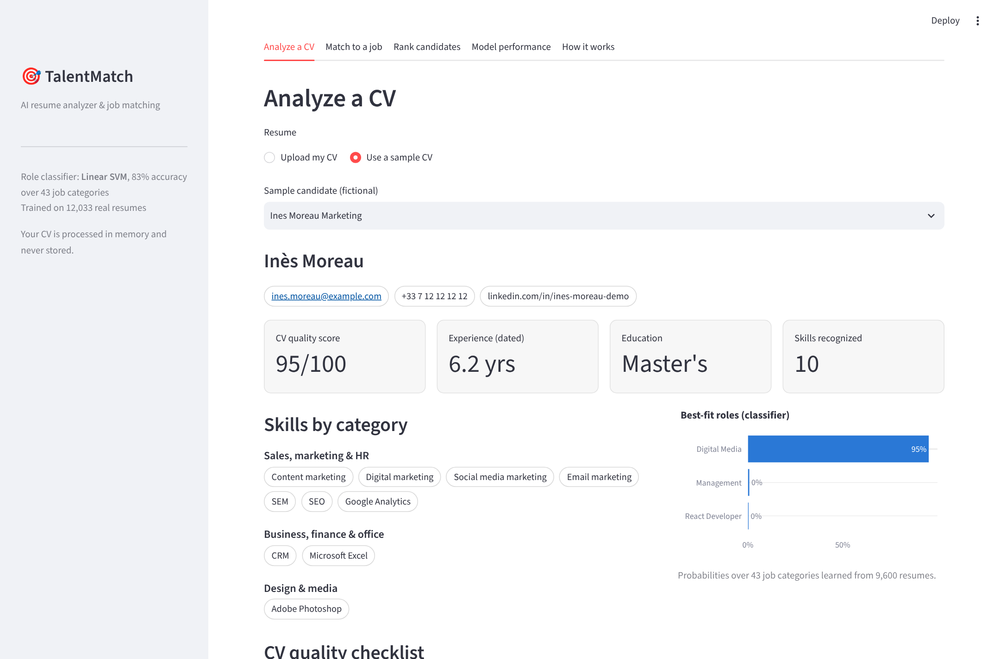
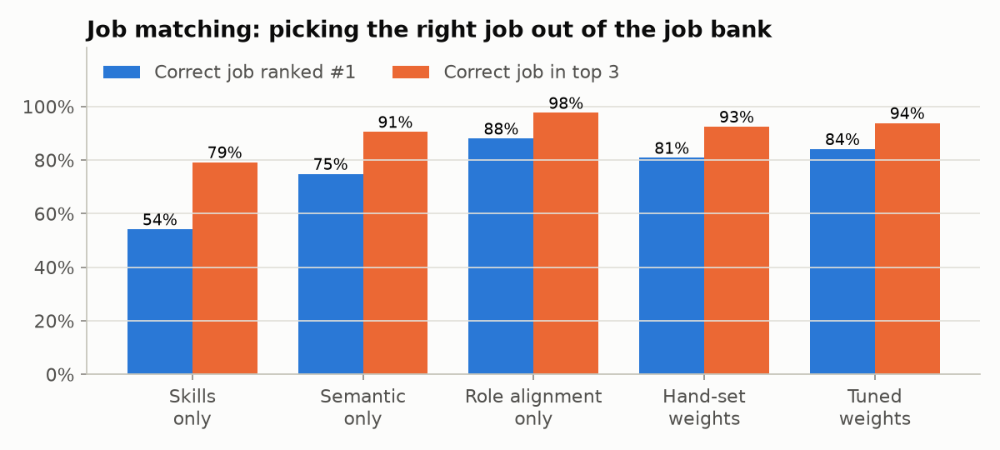
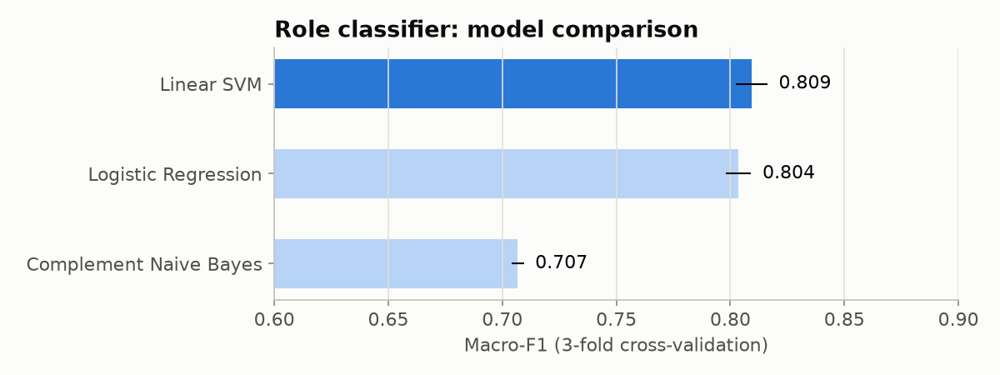
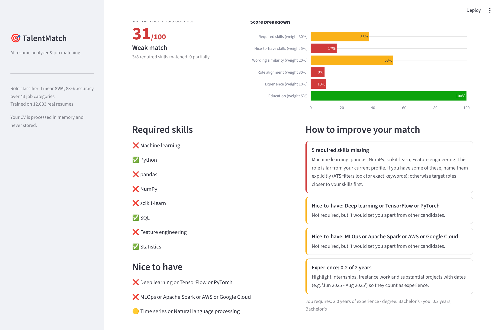
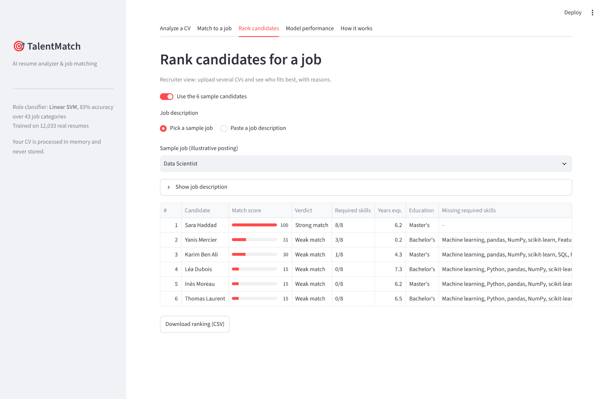

# TalentMatch: AI Resume Analyzer & Job Matching

TalentMatch reads a CV (PDF or DOCX), extracts skills, experience and education, scores the CV's
quality, and **matches it against job descriptions with an explainable score**: which requirements
are met, which are missing, and what to do about it. Recruiters can also **rank many candidates
for one job**.



## Results (measured on held-out data)

Trained on **12,033 real resumes** across 43 job categories.

| What | Result |
|---|---|
| Role classifier accuracy (43 categories) | **83.4%** (macro-F1 0.833) |
| Correct role among the classifier's top 3 | **95.1%** |
| Job matching: right job ranked #1 out of 27 | **84.2%** (random: 3.7%) |
| Job matching: right job in the top 3 | **93.9%** (random: 11.1%) |

| Job matching: ablation | Role classifier: model comparison |
|---|---|
|  |  |

### Things I learned building it

- **Duplicated datasets inflate accuracy.** A popular public resume dataset (962 rows) has
  **796 exact duplicates**: only 166 unique resumes. Tutorials reporting ~99% accuracy on it are
  testing on resumes they trained on. I used a larger dataset and removed 1,356 empty, short or
  duplicate rows before splitting.
- **Hand-picked weights are a guess, so I measured them.** My first hand-set weights ranked the right
  job first 81% of the time. Tuning them on a validation set (never the test set) raised it to
  84%.
- **The best number isn't always the right product.** The unconstrained optimum put 60% of the
  weight on role alignment (88% top-1). But a candidate with every required skill would then be
  scored down just because their past job title differs. I capped role alignment at 30% and kept
  skills as the main driver, accepting a few points of ranking accuracy for a fairer score.

## Features

**For candidates**
- Upload a CV (PDF, DOCX, TXT): contact info, skills grouped by category, years of experience
  (date ranges with overlaps merged), education level, spoken languages
- **CV quality score** with a checklist: contact details, sections, length, quantified impact,
  action verbs, weak phrases, tone
- **Best-fit roles** predicted by the classifier, plus the best matching jobs
- **Match against any job description**: score 0-100, breakdown, met / partially met / missing
  requirements, and concrete steps to improve

**For recruiters**
- **Rank up to 30 candidates** for a job, with matched and missing requirements per candidate,
  exported as CSV

**Under the hood**
- Section detection in **English and French** (Expérience, Formation, Compétences...)
- **Skills taxonomy**: 350+ skills and 800+ aliases (*JS → JavaScript*, *k8s → Kubernetes*), with
  guards against false positives (*C* is not matched inside *C++*, *R* is not matched inside *R&D*)
- **Skill families** for partial credit: knowing *PyTorch* partially covers a *TensorFlow*
  requirement
- Job analysis that separates **required** from **nice-to-have** skills and understands
  **either/or requirements** (*"AWS or Azure"* is satisfied by either one)

| Match a CV to a job | Rank candidates |
|---|---|
|  |  |

## How the match score works

| Component | Weight | What it measures |
|---|---|---|
| Required skills | 30% | Share of requirements met (partial credit 0.5 via related skills) |
| Role alignment | 30% | Overlap of the CV's and the job's role profiles (classifier probabilities) |
| Wording similarity | 20% | Latent Semantic Analysis similarity: related vocabulary, not just exact keywords |
| Experience | 10% | Candidate years / years required (capped at 100%) |
| Nice-to-have skills | 5% | Share of preferred skills met |
| Education | 5% | Degree level vs. degree required |

Components that don't apply (e.g. no years stated in the job) are left out and the remaining
weights are renormalized. Weights are tuned by grid search on a validation split (maximizing
MRR), with the constraints explained above.

## Architecture

```
PDF / DOCX ──▶ parsing ──▶ sections ──▶ skills + facts ──▶ Resume
                                                              │
Job text ────▶ job analysis (required / preferred / OR groups)│
                                                              ▼
           text models (TF-IDF + calibrated Linear SVM, LSA) ──▶ match score ──▶ advice
                                                              │
                                     FastAPI (api/)  ◀────────┴────────▶  Streamlit (dashboard/)
```

```
TalentMatch/
├── talentmatch/
│   ├── parsing.py       # PDF/DOCX text extraction, cleaning, EN/FR section detection
│   ├── taxonomy.py      # 350+ skills, aliases, families
│   ├── skills.py        # fast regex skill extraction, partial-credit relations
│   ├── info.py          # contact, years of experience, education, languages
│   ├── resume.py        # Resume object
│   ├── jobs.py          # job description analysis
│   ├── text_models.py   # role classifier + semantic space
│   ├── matching.py      # explainable match score
│   ├── advice.py        # CV quality checks + tailoring advice
│   ├── evaluation.py    # ranking metrics + weight tuning
│   ├── service.py       # entry point for API and dashboard
│   ├── data.py          # dataset download + cleaning/deduplication
│   └── train.py         # train, tune and evaluate everything
├── api/main.py          # FastAPI service
├── dashboard/app.py     # Streamlit app
├── data/jobs/           # 27 illustrative job postings
├── data/samples/        # 6 fictional demo CVs (PDF/DOCX) + generator script
├── models/              # trained models + metadata.json
├── reports/             # metrics and figures
└── tests/               # 40 pytest tests
```

## Getting started (Windows / VS Code)

```powershell
python -m venv .venv
.venv\Scripts\activate
pip install -r requirements.txt

streamlit run dashboard/app.py      # dashboard → http://localhost:8501
uvicorn api.main:app --reload       # API → http://127.0.0.1:8000/docs
pytest                              # 40 tests
python -m talentmatch.train         # optional: retrain (~5 min, downloads the dataset)
```

The trained model is included, so the app runs immediately. In VS Code, the **Run and Debug**
panel (Ctrl+Shift+D) has one-click configurations. With Docker: `docker compose up --build`.

## API

| Method | Endpoint | Purpose |
|---|---|---|
| POST | `/resume/analyze` | Upload a CV: parsed info, skills, roles, quality report, job recommendations |
| POST | `/match` | Upload a CV + job text: match score, breakdown, gaps, advice |
| POST | `/match/text` | Same, with the CV as plain text |
| POST | `/rank` | Upload up to 30 CVs + job text: ranked candidates |
| POST | `/job/analyze` | Required / preferred skills, years and degree from a job description |
| GET | `/jobs`, `/jobs/{id}` | Sample job bank |
| GET | `/health`, `/model-info` | Status, metrics, weights |

## Limitations

- The score is a **decision-support tool, not a decision maker**. A human should review every
  candidate, and the score should never be the only filter.
- Skill extraction is dictionary-based, so skills outside the taxonomy are not counted (easy to
  extend in `taxonomy.py`).
- The role classifier is trained on English resumes. French CVs are parsed and matched, but role
  predictions are less reliable.
- Scanned (image) PDFs need OCR, which is not included.
- The 27 job postings are illustrative examples written for this project, not real offers.
- Resume datasets reflect who wrote them. A production system would need bias audits (e.g.
  checking that scores don't vary with names or gender-coded wording).

## Data

[Resume-Classification-Dataset](https://github.com/noran-mohamed/Resume-Classification-Dataset)
(MIT license): ~13,000 resumes from LiveCareer and other public sources, 43 categories.
It's downloaded automatically by `python -m talentmatch.train`. Demo CVs in `data/samples/` are
fictional.
